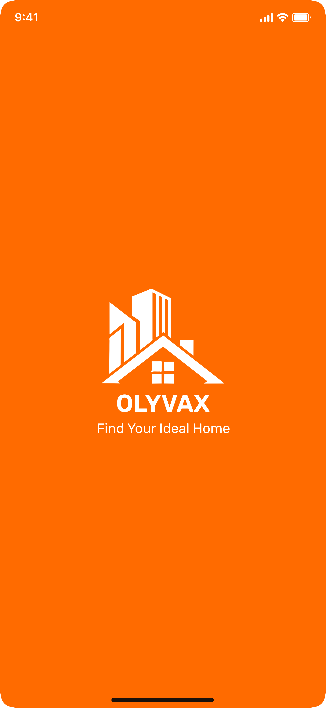
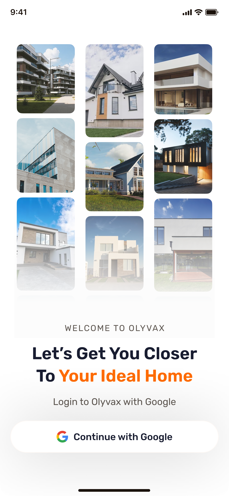
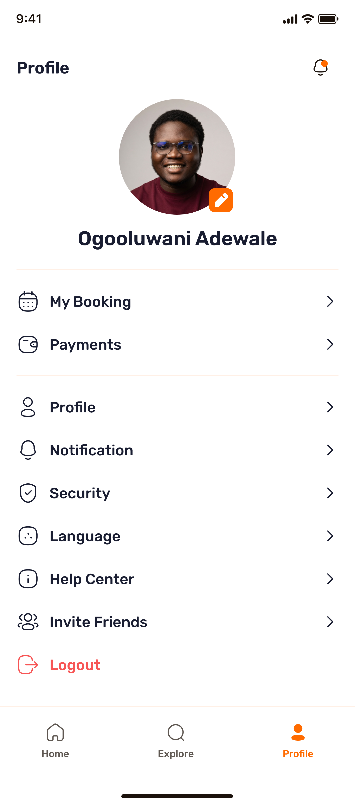
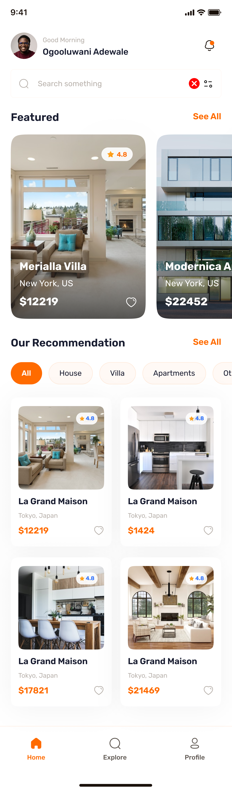
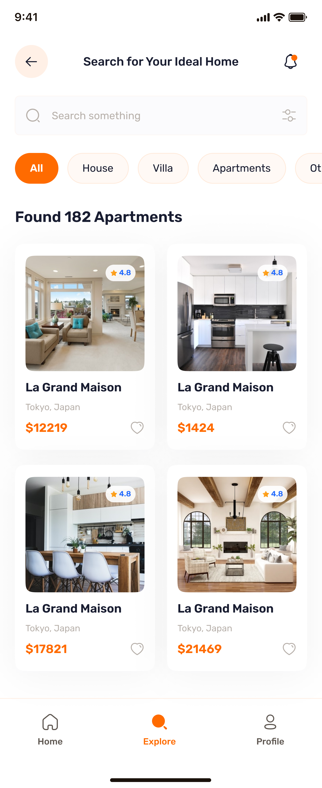
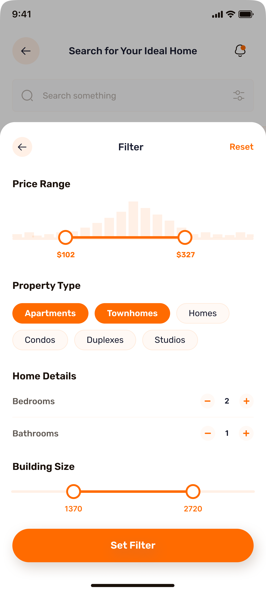
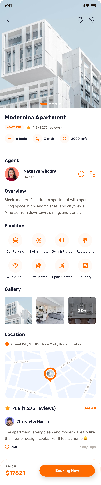

# Olyvax

Olyvax is a React Native property discovery project built with Expo. It is not a real estate product or a production marketplace. It is a portfolio/practice project that explores how a modern property browsing mobile app could work: authentication, listings, search, filters, pagination, property details, galleries, and a profile area.

The app uses Appwrite as its backend for authentication and property data. Users can sign in, browse featured and recommended properties, search listings, apply filters, view property details, and inspect gallery images.

## Screenshots

| Splash                                                                             | Sign In                                                                           | Profile                                                                              |
| ---------------------------------------------------------------------------------- | --------------------------------------------------------------------------------- | ------------------------------------------------------------------------------------ |
|  |  |  |

| Home                                                                           | Explore                                                                              | Filter                                                                             |
| ------------------------------------------------------------------------------ | ------------------------------------------------------------------------------------ | ---------------------------------------------------------------------------------- |
|  |  |  |

| Property Details                                                                              |
| --------------------------------------------------------------------------------------------- |
|  |

## Features

- Google authentication with Appwrite.
- Home screen with featured listings and recommendations.
- Explore screen with paginated property results.
- Search by property name, address, and type.
- Category filters for property types.
- Bottom-sheet filter modal for price range, property type, bedrooms, bathrooms, and area.
- Property detail screen with image gallery, facilities, reviews, map preview, and agent information.
- Profile screen with user avatar, settings, and logout confirmation.
- Skeleton loaders and empty states for better loading feedback.

## Tech Stack

- Expo
- React Native
- Expo Router
- TypeScript
- NativeWind
- Appwrite
- Expo Image

## Project Structure

```text
app/                 App routes and screens
components/          Reusable UI components
constants/           Static data, images, icons, and helpers
lib/                 Appwrite, global provider, hooks, image helpers
assets/              Fonts, icons, and images
```

## Getting Started

Install dependencies:

```bash
npm install
```

Create a `.env` file with the required Appwrite values:

```bash
EXPO_PUBLIC_APPWRITE_ENDPOINT=
EXPO_PUBLIC_APPWRITE_PROJECT_ID=
EXPO_PUBLIC_APPWRITE_DATABASE_ID=
EXPO_PUBLIC_APPWRITE_GALLERIES_COLLECTION_ID=
EXPO_PUBLIC_APPWRITE_REVIEWS_COLLECTION_ID=
EXPO_PUBLIC_APPWRITE_AGENTS_COLLECTION_ID=
EXPO_PUBLIC_APPWRITE_PROPERTIES_COLLECTION_ID=
```

Start the development server:

```bash
npm run start
```

Then open the app with Expo Go, an Android emulator, or an iOS simulator.

## Scripts

```bash
npm run start
npm run android
npm run ios
npm run web
npm run lint
```

## Notes

This project depends on a configured Appwrite project and matching collection attributes. Filtering expects fields such as `price`, `type`, `bedrooms`, `bathrooms`, and `area` to exist on property documents.

Remote property images may come from different hosts. The app includes a small image URL normalizer to handle known property image host issues.
